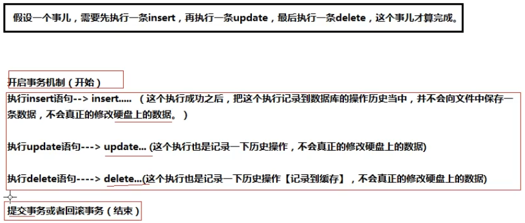
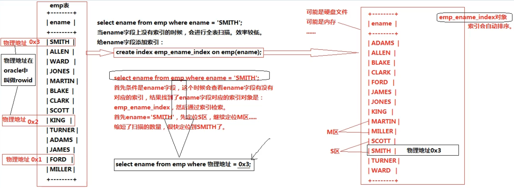

## MySQL基础知识

### 表Table

什么是表？

​	table是数据库的基本组成单元，所有的数据都以表格的形式组织，目的是可读性强。

一个table包括行和列：

​	行：被称为数据/记录（data）

​	列：被称为字段（column）

| 学号(int) | 姓名（varchar） | 年龄(int) |
| :-------: | :-------------: | :-------: |
|    110    |       zs        |    20     |
|    111    |       ls        |    22     |

每个字段应该包含的属性有：

​	字段名、数据类型、相关的约束。

SQL语句分类：

​	DQL（数据查询语言）：查询语句，凡是select语句都是DQL；

​	DML（数据操作语言）：insert delete update，对表当中的数据进行增删改；

​	DDL（数据定义语言）：create drop alter，对表结构的增删改；

​	TCL（事物控制语言）：commit提交事务，rollback回滚事务；

​	DCL（数据控制语言）：grant授权、revoke撤销权限等。

导入数据：

​	第一步：登录mysql数据库管理系统

​		dos命令窗口： mysql -uroot -p1233

​	第二步：查看有哪些数据库

​		show databases;（这个不是SQL语句，属于MySQL的命令。）

```mysql
    mysql> show databases;
    +--------------------+
    | Database           |
    +--------------------+
    | information_schema |
    | mysql              |
    | performance_schema |
    | sakila             |
    | sys                |
    | world              |
    +--------------------+
    6 rows in set (0.02 sec)
```

​	第三步：创建新的数据库

​		create database testsql;

​	第四步：使用创建的数据库

​		use testsql;

​	第五步：查看当前数据库中有哪些表

​		show tables;

​	第六步：初始化数据

​		mysql> source E:\研究生\2021\MySQLNotes\SQL文件\testsql\testsql.sql

初始化完成后，再次查看表：

```
mysql> show tables;
+-------------------+
| Tables_in_testsql |
+-------------------+
| dept              |
| emp               |
| salgrade          |
+-------------------+
3 rows in set (0.00 sec)
```

查看具体表的信息（表的结构）：

```mysql
mysql> desc dept;
+--------+-------------+------+-----+---------+-------+
| Field  | Type        | Null | Key | Default | Extra |
+--------+-------------+------+-----+---------+-------+
| DEPTNO | int         | NO   | PRI | NULL    |       |
| DNAME  | varchar(14) | YES  |     | NULL    |       |
| LOC    | varchar(13) | YES  |     | NULL    |       |
+--------+-------------+------+-----+---------+-------+
3 rows in set (0.02 sec)
```

查看表内部信息：select属于SQL语句。

```mysql
mysql> select * from dept;
+--------+------------+----------+
| DEPTNO | DNAME      | LOC      |
+--------+------------+----------+
|     10 | ACCOUNTING | NEW YORK |
|     20 | RESEARCH   | DALLAS   |
|     30 | SALES      | CHICAGO  |
|     40 | OPERATIONS | BOSTON   |
+--------+------------+----------+
4 rows in set (0.00 sec)
```

查看创建表的语句：

```mysql
mysql> show create table emp;
```

简单的查询语句（DQL）

​	语法格式： select 字段名1，字段名1... from 表名;

​	！任何SQL语句都是以“;”结尾；SQL语句不区分大小写。

​	例子：查询员工的工资：（字段可以参与运算！）

```mysql
mysql> select ename,sal * 12 from emp;
+--------+----------+
| ename  | sal * 12 |
+--------+----------+
| SMITH  |  9600.00 |
| ALLEN  | 19200.00 |
| WARD   | 15000.00 |
| JONES  | 35700.00 |
| MARTIN | 15000.00 |
| BLAKE  | 34200.00 |
| CLARK  | 29400.00 |
| SCOTT  | 36000.00 |
| KING   | 60000.00 |
| TURNER | 18000.00 |
| ADAMS  | 13200.00 |
| JAMES  | 11400.00 |
| FORD   | 36000.00 |
| MILLER | 15600.00 |
+--------+----------+
14 rows in set (0.01 sec)
```

​	给查询结果的列重命名：用 as 关键字，且可以省略。重命的名字可以为中文，用 单引号 引用。

```mysql
mysql> select ename,sal * 12 as salyear from emp;
+--------+----------+
| ename  | salyear  |
+--------+----------+
| SMITH  |  9600.00 |
| ALLEN  | 19200.00 |
| WARD   | 15000.00 |
| JONES  | 35700.00 |
| MARTIN | 15000.00 |
| BLAKE  | 34200.00 |
| CLARK  | 29400.00 |
| SCOTT  | 36000.00 |
| KING   | 60000.00 |
| TURNER | 18000.00 |
| ADAMS  | 13200.00 |
| JAMES  | 11400.00 |
| FORD   | 36000.00 |
| MILLER | 15600.00 |
+--------+----------+
14 rows in set (0.00 sec)
```

​	条件查询

​		语法格式：

​			select 字段名1,字段名2... from 表名 where 条件;

​		举例

```mysql
mysql> select ename,sal,deptno from emp where sal > 1000 and (deptno = 20 or deptno = 30);
+--------+---------+--------+
| ename  | sal     | deptno |
+--------+---------+--------+
| ALLEN  | 1600.00 |     30 |
| WARD   | 1250.00 |     30 |
| JONES  | 2975.00 |     20 |
| MARTIN | 1250.00 |     30 |
| BLAKE  | 2850.00 |     30 |
| SCOTT  | 3000.00 |     20 |
| TURNER | 1500.00 |     30 |
| ADAMS  | 1100.00 |     20 |
| FORD   | 3000.00 |     20 |
+--------+---------+--------+
9 rows in set (0.00 sec)
```

​		！当运算符的优先级不确定的时候建议加小括号。

​	in等同于or。注意：in后面括号里面的值不是区间，而是具体的值。

​	模糊查询like。

​		在模糊查询中，必须掌握两个特殊的符号，%和_。%代表任意多个字符； _代表任意1个字符。

​	排序。用关键字order by。默认是升序。asc升序；desc降序。

​		举例：按照工资降序排列，当工资相同时，按照用户名的升序排列。

```mysql
mysql> select ename,sal from emp order by sal desc, ename asc;
+--------+---------+
| ename  | sal     |
+--------+---------+
| KING   | 5000.00 |
| FORD   | 3000.00 |
| SCOTT  | 3000.00 |
| JONES  | 2975.00 |
| BLAKE  | 2850.00 |
| CLARK  | 2450.00 |
| ALLEN  | 1600.00 |
| TURNER | 1500.00 |
| MILLER | 1300.00 |
| MARTIN | 1250.00 |
| WARD   | 1250.00 |
| ADAMS  | 1100.00 |
| JAMES  |  950.00 |
| SMITH  |  800.00 |
+--------+---------+
14 rows in set (0.00 sec)
```

​		！越靠前的字段越能起到主导作用。 

​	分组函数()：

​		count、sum、avg、max、min等属于分组函数，用于有group by 条件的SQL语句中。所有的分组函数都是对一组数据进行排序的。

​		sum(case (可加字段名) when 条件... then 1 else 0 end) ：统计满足条件的数量。一般后面会跟上分组函数group by语句。在select后面使用，作为结果输出。

​		！分组函数自动忽略_NULL_。

​		只要有_NULL_参与的运算，结果都是_NULL_。

​		<font color=#FF0000>！where后面不能直接用分组函数。因为分组函数一般是在group by或having语句执行结束才能执行，而where语句的执行顺序要优于group by和having语句。</font>可以用子查询语句处理相关的问题。

​	ifnull()空处理函数：属于单行处理函数。

​	group by 和 having

​		group by：按照某个字段或者某些字段进行分组。

​		having：是对分组之后的数据进行再次过滤。

​		案例1：找出每个工作岗位的最高薪资。

```mysql
mysql> select max(sal),job from emp group by job;
+----------+-----------+
| max(sal) | job       |
+----------+-----------+
|  1300.00 | CLERK     |
|  1600.00 | SALESMAN  |
|  2975.00 | MANAGER   |
|  3000.00 | ANALYST   |
|  5000.00 | PRESIDENT |
+----------+-----------+
5 rows in set (0.00 sec)
```

​		！分组函数一般都会和group by联合使用。并且任何一个分组函数都是在group by语句执行结束之后才会执行。当一条语句中没有group by 语句的时候，整张表的数据会自成一组。

​		DQL语句的执行顺序：

```mysql
select			5
	...
from			1
	...
where			2
	...
group by		3
	...
having			4
	...
order by		6
	...
```

​		案例2：找出不同部门不同工作岗位的最高薪资，按部门排序。

```mysql
mysql> select deptno,job,max(sal) from emp group by deptno,job order by deptno;
+--------+-----------+----------+
| deptno | job       | max(sal) |
+--------+-----------+----------+
|     10 | CLERK     |  1300.00 |
|     10 | MANAGER   |  2450.00 |
|     10 | PRESIDENT |  5000.00 |
|     20 | ANALYST   |  3000.00 |
|     20 | CLERK     |  1100.00 |
|     20 | MANAGER   |  2975.00 |
|     30 | CLERK     |   950.00 |
|     30 | MANAGER   |  2850.00 |
|     30 | SALESMAN  |  1600.00 |
+--------+-----------+----------+
9 rows in set (0.00 sec)
```

​		案例3：找出不同部门的最高薪资，要求工资大于2900。

```mysql
mysql> select max(sal),deptno from emp group by deptno having max(sal) > 2900;  这个方式不建议使用，因为会增加分组的数量，效率更低。
mysql> select max(sal),deptno from emp where sal > 2900 group by deptno;	建议使用where先进行一次条件筛选，这样的话，进行分组的数量就会减少，使效率更高。
+----------+--------+
| max(sal) | deptno |
+----------+--------+
|  3000.00 |     20 |
|  5000.00 |     10 |
+----------+--------+
2 rows in set (0.00 sec)
```

​		案例3：找出不同部门的平均薪资，要求平均薪资大于2000。

​		这种情况就不能用where，只能用having进行过滤。

```mysql
mysql> select avg(sal),deptno from emp group by deptno having avg(sal) > 2000;
+-------------+--------+
| avg(sal)    | deptno |
+-------------+--------+
| 2175.000000 |     20 |
| 2916.666667 |     10 |
+-------------+--------+
2 rows in set (0.01 sec)
```

distinct关键字的使用：对查询结果集进行数据去重。distinct只能出现在字段的最前面，如果有多个关键字，则是对其的联合去重。

​	案例：统计岗位的数量

```mysql
mysql> select count(distinct job) from emp;
+---------------------+
| count(distinct job) |
+---------------------+
|                   5 |
+---------------------+
1 row in set (0.02 sec)
```

连接查询：从多张表中进行数据查询。

​	连接查询的分类：
​		按照表的连接方式来划分：

​			内连接：

​				等值连接

​				非等值连接

​				自连接

​			外连接：

​				左外连接

​				右外连接

​			全连接（用得少。了解）

​	关于表的别名（as关键字，可省略）的使用

​		好处：执行效率高；可读性好。

```mysql
笛卡尔乘积现象：两张表连接查询的时候，没有条件就会出现这个现象。
mysql> select e.ename,d.dname from emp e,dept d; 
+--------+------------+
| ename  | dname      |
+--------+------------+
| SMITH  | OPERATIONS |
| SMITH  | SALES      |
| SMITH  | RESEARCH   |
| SMITH  | ACCOUNTING |
| ALLEN  | OPERATIONS |
| ALLEN  | SALES      |
| ALLEN  | RESEARCH   |
| ALLEN  | ACCOUNTING |
| ...    | ...        |
+--------+------------+
56 rows in set (0.00 sec)
```

​	在连接查询的时候，加条件进行查询可以避免笛卡尔乘积现象的出现。

​		注意：以上面结果为例，匹配结果还是56次，但显示的只是有效记录。

```mysql
SQL92：
    select
        ...
    from
        ...
    where
        ...
 SQL99:
 	select
 		...
 	from
 		...
 	join
 		...
 	on
 		...
	where
		...
```

​	SQL99比SQL92语法结构更清晰，表的连接条件和后面的where条件分离了。	

​	内连接之等值连接：最大的特点：条件是等量关系。inner join... on...。inner可以省略。

​		案例：查询每个员工的部门编号，要求显示员工名和部门名。

```mysql
mysql> select e.ename,d.dname from emp e join dept d on e.deptno=d.deptno;
+--------+------------+
| ename  | dname      |
+--------+------------+
| SMITH  | RESEARCH   |
| ALLEN  | SALES      |
| WARD   | SALES      |
| JONES  | RESEARCH   |
| MARTIN | SALES      |
| BLAKE  | SALES      |
| CLARK  | ACCOUNTING |
| SCOTT  | RESEARCH   |
| KING   | ACCOUNTING |
| TURNER | SALES      |
| ADAMS  | RESEARCH   |
| JAMES  | SALES      |
| FORD   | RESEARCH   |
| MILLER | ACCOUNTING |
+--------+------------+
14 rows in set (0.00 sec)
```

​	内连接之非等值连接：最大的特点：条件不是等量关系。

​		案例：找出每个员工的工资等级，要求显示员工名、工资、工资等级。

```mysql
mysql> select e.ename,e.sal,s.grade from emp e join salgrade s on e.sal between s.losal and s.hisal;
+--------+---------+-------+
| ename  | sal     | grade |
+--------+---------+-------+
| SMITH  |  800.00 |     1 |
| ALLEN  | 1600.00 |     3 |
| WARD   | 1250.00 |     2 |
| JONES  | 2975.00 |     4 |
| MARTIN | 1250.00 |     2 |
| BLAKE  | 2850.00 |     4 |
| CLARK  | 2450.00 |     4 |
| SCOTT  | 3000.00 |     4 |
| KING   | 5000.00 |     5 |
| TURNER | 1500.00 |     3 |
| ADAMS  | 1100.00 |     1 |
| JAMES  |  950.00 |     1 |
| FORD   | 3000.00 |     4 |
| MILLER | 1300.00 |     2 |
+--------+---------+-------+
14 rows in set (0.00 sec)
```

​	内连接之自连接：最大的特点：一张表看成两张表。

​		案例：找出每个员工的上级领导，要求显示员工名和对应的领导名字。

```mysql
mysql> select e.ename as '员工名',b.ename as '领导名' from emp a join emp b on a.mgr=b.empno;
+--------+--------+
| 员工名 | 领导名 |
+--------+--------+
| SMITH  | FORD   |
| ALLEN  | BLAKE  |
| WARD   | BLAKE  |
| JONES  | KING   |
| MARTIN | BLAKE  |
| BLAKE  | KING   |
| CLARK  | KING   |
| SCOTT  | JONES  |
| TURNER | BLAKE  |
| ADAMS  | SCOTT  |
| JAMES  | BLAKE  |
| FORD   | JONES  |
| MILLER | CLARK  |
+--------+--------+
13 rows in set (0.04 sec)
```

外连接 outer join。outer 可以省略。

​	和内连接的区别：

​		内连接：假设A和B表进行连接，使用内连接的话，凡是A表和B表能够匹配上的记录查询出来，这就是内连接。A、B两张表没有主副之分，平等的。

​		外连接：假设A和B表进行连接，使用内连接的话，A、B两张表中有一张表是主表，一张表是副表，查询以主表中的数据为主。当副表中的数据没有和主表中的数据匹配上，副表自动模拟出NULL与之匹配。

​	左外连接（左连接）：左边的表为主表。left join

​		案例1：找出所有员工的领导。

```mysql
mysql> select a.ename as '员工名',b.ename as '领导名' from emp a left join emp b on a.mgr=b.empno;
+--------+--------+
| 员工名 | 领导名 |
+--------+--------+
| SMITH  | FORD   |
| ALLEN  | BLAKE  |
| WARD   | BLAKE  |
| JONES  | KING   |
| MARTIN | BLAKE  |
| BLAKE  | KING   |
| CLARK  | KING   |
| SCOTT  | JONES  |
| KING   | NULL   |
| TURNER | BLAKE  |
| ADAMS  | SCOTT  |
| JAMES  | BLAKE  |
| FORD   | JONES  |
| MILLER | CLARK  |
+--------+--------+
14 rows in set (0.00 sec)
```

​	右外连接（右连接）：右边的表为主表。right join

```mysql
mysql> select a.ename as '员工名',b.ename as '领导名' from emp b right join emp a on a.mgr=b.empno;
+--------+--------+
| 员工名 | 领导名 |
+--------+--------+
| SMITH  | FORD   |
| ALLEN  | BLAKE  |
| WARD   | BLAKE  |
| JONES  | KING   |
| MARTIN | BLAKE  |
| BLAKE  | KING   |
| CLARK  | KING   |
| SCOTT  | JONES  |
| KING   | NULL   |
| TURNER | BLAKE  |
| ADAMS  | SCOTT  |
| JAMES  | BLAKE  |
| FORD   | JONES  |
| MILLER | CLARK  |
+--------+--------+
14 rows in set (0.00 sec)
```

​	案例2：找出哪个部门没有员工。

```mysql
mysql> select d.* from emp e right join dept d on e.deptno=d.deptno where e.empn
o is null;
+--------+------------+--------+
| DEPTNO | DNAME      | LOC    |
+--------+------------+--------+
|  40 | OPERATIONS | BOSTON |
+--------+------------+--------+
1 row in set (0.00 sec)
```

​	案例3：找出每一个员工的部门名称、工资等级、以及上级领导。

```mysql
mysql> select e.ename as '员工',d.dname as '部门名称',s.grade as '工资等级',a.ename as '上级领导' from emp e left join emp a on e.mgr=a.empno join dept d on e.deptno=d.deptno join salgrade s on e.sal between s.losal and s.hisal;
+--------+------------+----------+----------+
| 员工   | 部门名称   | 工资等级 | 上级领导	 |
+--------+------------+----------+----------+
| SMITH  | RESEARCH   |        1 | FORD     |
| ALLEN  | SALES      |        3 | BLAKE    |
| WARD   | SALES      |        2 | BLAKE    |
| JONES  | RESEARCH   |        4 | KING     |
| MARTIN | SALES      |        2 | BLAKE    |
| BLAKE  | SALES      |        4 | KING     |
| CLARK  | ACCOUNTING |        4 | KING     |
| SCOTT  | RESEARCH   |        4 | JONES    |
| KING   | ACCOUNTING |        5 | NULL     |
| TURNER | SALES      |        3 | BLAKE    |
| ADAMS  | RESEARCH   |        1 | SCOTT    |
| JAMES  | SALES      |        1 | BLAKE    |
| FORD   | RESEARCH   |        4 | JONES    |
| MILLER | ACCOUNTING |        2 | CLARK    |
+--------+------------+----------+----------+
14 rows in set (0.01 sec)
```

嵌套子句

​	在from后面嵌套子查询

​		案例：找出每个部门平均薪资的薪资等级。

```mysql
第一步：找出每个部门平均薪资（按照部门编号分组，求平均值）
mysql> select deptno,avg(sal) from emp group by deptno;
+--------+-------------+
| deptno | avg(sal)    |
+--------+-------------+
|     20 | 2175.000000 |
|     30 | 1566.666667 |
|     10 | 2916.666667 |
+--------+-------------+
3 rows in set (0.00 sec)
第二步：按部门的平均薪资划分等级。（将第一步查询结果看成一张新表a，将a表与salgrade表进行连接查询）
SQL92写法：
mysql> select a.deptno as '部门编号',a.avg as '平均薪资',s.grade as '薪资等级' from (select deptno,avg(sal) as avg from emp group by deptno) a,salgrade s where a.avg between s.losal and s.hisal;
SQL99写法：
mysql> select a.deptno as '部门编号',a.avg as '平均薪资',s.grade as '薪资等级' from (select deptno,avg(sal) as avg from emp group by deptno) a join salgrade s on a.avg between s.losal and s.hisal;
+----------+-------------+----------+
| 部门编号 | 平均薪资    | 薪资等级    |
+----------+-------------+----------+
|       20 | 2175.000000 |        4 |
|       30 | 1566.666667 |        3 |
|       10 | 2916.666667 |        4 |
+----------+-------------+----------+
3 rows in set (0.00 sec)

```

​		案例：找出每个部门薪资等级的平均值。

```mysql
第一步：找出每个部门员工的薪资等级
mysql> select e.ename,s.grade from emp e join salgrade s on e.sal between s.losal and s.hisal;
+--------+-------+
| ename  | grade |
+--------+-------+
| SMITH  |     1 |
| ALLEN  |     3 |
| WARD   |     2 |
| JONES  |     4 |
| MARTIN |     2 |
| BLAKE  |     4 |
| CLARK  |     4 |
| SCOTT  |     4 |
| KING   |     5 |
| TURNER |     3 |
| ADAMS  |     1 |
| JAMES  |     1 |
| FORD   |     4 |
| MILLER |     2 |
+--------+-------+
14 rows in set (0.00 sec)
第二步：在第一步的基础上，按部门分组，计算平均等级。
mysql> select e.deptno,avg(s.grade) from emp e join salgrade s on e.sal between s.losal and s.hisal group by e.deptno;
+--------+--------------+
| deptno | avg(s.grade) |
+--------+--------------+
|     20 |       2.8000 |
|     30 |       2.5000 |
|     10 |       3.6667 |
+--------+--------------+
3 rows in set (0.00 sec)
```

​	在select后面嵌套子查询

​		案例：找出每个员工所在的部门名称，要求显示员工名和部门名。

```mysql
第一种方式：
mysql> select e.ename,d.dname from emp e join dept d on e.deptno=d.deptno;
+--------+------------+
| ename  | dname      |
+--------+------------+
| SMITH  | RESEARCH   |
| ALLEN  | SALES      |
| WARD   | SALES      |
| JONES  | RESEARCH   |
| MARTIN | SALES      |
| BLAKE  | SALES      |
| CLARK  | ACCOUNTING |
| SCOTT  | RESEARCH   |
| KING   | ACCOUNTING |
| TURNER | SALES      |
| ADAMS  | RESEARCH   |
| JAMES  | SALES      |
| FORD   | RESEARCH   |
| MILLER | ACCOUNTING |
+--------+------------+
14 rows in set (0.00 sec)
第二种方式：
mysql> select e.ename,(select d.dname from dept d where e.deptno=d.deptno) as dname from emp e;
+--------+------------+
| ename  | dname      |
+--------+------------+
| SMITH  | RESEARCH   |
| ALLEN  | SALES      |
| WARD   | SALES      |
| JONES  | RESEARCH   |
| MARTIN | SALES      |
| BLAKE  | SALES      |
| CLARK  | ACCOUNTING |
| SCOTT  | RESEARCH   |
| KING   | ACCOUNTING |
| TURNER | SALES      |
| ADAMS  | RESEARCH   |
| JAMES  | SALES      |
| FORD   | RESEARCH   |
| MILLER | ACCOUNTING |
+--------+------------+
14 rows in set (0.00 sec)
```

union（可以将查询结果集进行拼接）

​	案例：找出工作岗位是SALESMAN和MANAGER的员工。

```mysql
方式1：
mysql> select ename,job from emp where job='SALESMAN' or job='MANAGER';
方式2：
mysql> select ename,job from emp where job in ('SALESMAN','MANAGER');
方式3：
mysql> select ename,job from emp where job='SALESMAN' union select ename,job from emp where job='MANAGER';
+--------+----------+
| ename  | job      |
+--------+----------+
| ALLEN  | SALESMAN |
| WARD   | SALESMAN |
| MARTIN | SALESMAN |
| TURNER | SALESMAN |
| JONES  | MANAGER  |
| BLAKE  | MANAGER  |
| CLARK  | MANAGER  |
+--------+----------+
7 rows in set (0.00 sec)
```

limit（主要用在分页查询中。重点 \*****）

​	limit是MySQL特有的，其他数据库中没有，非通用。（oracle中有一个相同的机制，叫做rownum）

​	limit的作用：取结果集中的部分数据。

​	limit语法机制：

​	limit startIndex, length

​		startIndex表示起始位置；

​		length表示取几个。

​	案例：找出工资排名在第4到第9名的员工。（降序取前6个）

```mysql
mysql> select ename,sal from emp order by sal desc limit 3,6;
+--------+---------+
| ename  | sal     |
+--------+---------+
| JONES  | 2975.00 |
| BLAKE  | 2850.00 |
| CLARK  | 2450.00 |
| ALLEN  | 1600.00 |
| TURNER | 1500.00 |
| MILLER | 1300.00 |
+--------+---------+
6 rows in set (0.00 sec)
```

创建表

​	建表的语法格式：

```mysql
create table 表名(
	字段名1 数据类型,
    字段名2 数据类型,
    ...
);
```

​	--->关于MySQL当中字段的数据类型：

| 数据类型 |   类型名称   |                             描述                             |
| :------: | :----------: | :----------------------------------------------------------: |
|   int    |    整数型    |                         java中的int                          |
|  bigint  |   长整数型   |                         java中的long                         |
|  float   |    浮点型    |                     java中的float double                     |
|   char   |  定长字符串  |                        java中的String                        |
| varchar  | 可变长字符串 |    最多255个字符。对应java中的StringBuffer或StringBuilder    |
|   date   |   日期类型   |                                                              |
|   BLOB   | 二进制大对象 | Binary Large Object。存储图片、视频等流媒体信息。java中的Object |
|   CLOB   |  字符大对象  |   Character Large Object。存储较大文本信息。java中的Object   |

​	--->char和varchar如何选择？

​		在实际开发中，当某个字段中的数据长度不发生改变的时候，是定长的，例如：性别，生日等都是采用char。当一个字段的数据长度不确定，例如：简介，姓名等都是采用varchar。

insert语句向表中插入数据

​	语法格式：

```mysql
insert into 表名(字段名1,字段名2,...) values (值1,值2,...);
values后面可以跟多条语句，用 逗号 隔开。
```

​	要求：字段的数量和值的数量相同，并且数据类型也要对应相同。

表的复制

​	语法格式：

```mysql
create table 表名 as select语句;   将查询结果当做表创建出来。
```

修改表中数据 update

​	语法格式：

```mysql
update 表名 set 字段名1=值1,字段名2=值2,... where 条件;
如果没有条件，则更新整张表的数据。
```

​	案例：将部门10的LOC修改为SHANGHAI，将部门名称修改为RENSHIBU。

```mysql
mysql> update dept set loc='SHANGHAI', dname='RENSHIBU' where deptno=10;
Query OK, 1 row affected (0.12 sec)
Rows matched: 1  Changed: 1  Warnings: 0

mysql> select * from dept;
+--------+------------+----------+
| DEPTNO | DNAME      | LOC      |
+--------+------------+----------+
|     10 | RENSHIBU   | SHANGHAI |
|     20 | RESEARCH   | DALLAS   |
|     30 | SALES      | CHICAGO  |
|     40 | OPERATIONS | BOSTON   |
+--------+------------+----------+
4 rows in set (0.00 sec)
```

删除数据 delete 。 删除大表中的数据用truncate

​	语法格式：

```mysql
delete from 表名 where 条件;
注意：没有加条件，则全部删除。
truncate table 表名;
表被截断，不可回滚。
```

增删改查有一个术语：CRUD操作。

​	Create（添加） Retrieve（检索） Update（修改） Delete（删除）

！！！约束 constraint

​	约束的作用：保证表中数据的合法性、有效性、完整性。

​	常见的约束有哪些？

​		非空约束：not null。约束的字段不能为空。

​		唯一约束：unique	约束的字段不能重复。

​		主键约束：primary key 约束的字段既不能为NULL，也不能重复，简称PK。

​		外键约束：foreign key	简称FK。

​		检查约束：check	目前MySQL不支持该约束。

​	非空约束：not null。约束的字段不能为NULL。

```mysql
建表
create table t_user(
    id int,
    username varchar(255) not null,
    password varchar(255)
);
插入数据
mysql> insert into t_user(id,password) values(1,'123');
出现错误：username 没有默认值。
ERROR 1364 (HY000): Field 'username' doesn't have a default value
mysql> insert into t_user(id,username,password) values(1,'zs','123');
Query OK, 1 row affected (0.01 sec)
```

​	唯一约束：unique	约束的字段不能重复。

```mysql
1.在一个字段上加“唯一约束”。
drop table if exists t_user;
create table t_user(
	id int,
    username varchar(255) unique,
    age int
);
mysql> insert into t_user values(123,"lisi",23);
mysql> insert into t_user values(123,"lisi",24);
ERROR 1062 (23000): Duplicate entry 'lisi' for key 't_user.username'

2.在多个字段上加“唯一约束”。
两种方式：
drop table if exists t_user;
create table t_user(
	id int,
    username varchar(255) unique,
    usercode varchar(255) unique,   // 列级约束
    age int
);
mysql> insert into t_user values(123,"lisi","lisi",23);
Query OK, 1 row affected (0.09 sec)

mysql> insert into t_user values(123,"lisi","lisi",23);
ERROR 1062 (23000): Duplicate entry 'lisi' for key 't_user.username'

drop table if exists t_user;
create table t_user(
	id int,
    username varchar(255),
    usercode varchar(255),
    unique(username,usercode),  // 多个字段联合起来加唯一约束。表级约束
    age int
);
mysql> insert into t_user values(123,"lisi","lisi",23);
Query OK, 1 row affected (0.08 sec)

mysql> insert into t_user values(123,"lisi","lisi",23);
ERROR 1062 (23000): Duplicate entry 'lisi-lisi' for key 't_user.username'

```

​	主键约束：primary key 约束的字段既不能为NULL，也不能重复，简称PK。

```mysql
drop table if exists t_user;
create table t_user(
	id int primary key,
    username varchar(255) unique,
    age int
);
mysql> insert into t_user values(1,'ls',23);
select * from t_user;
mysql> insert into t_user values(1,'ww',23);
ERROR 1062 (23000): Duplicate entry '1' for key 't_user.PRIMARY'
```

​		主键有什么作用？

​		表的三范式，第一范式就是要有主键。

​		主键值是这行记录在这张表中的唯一标识。 

​		！！！<font color=#FFFF00>一张表的主键约束只能有一个。</font>

​		主键的分类：

​			根据主键的字段数量划分：

​				单一主键

​				复合主键（多个字段联合起来添加一个主键约束。不建议使用）

​			根据主键性质来划分：

​				自然主键：主键值最好和业务没有关系的自然数。

​				业务主键：主键值和系统的业务挂钩。比如身份证号作主键。<font color=#FFFF00>最好不要用业务主键这种形式，业务一旦改变，主键值就可能改变。</font>

！！！<font color=#FF0000>MySQL提供的主键值自增：auto_increment 。Oracle中的自增机制：sequence序列对象。</font>

​	外键约束  

​		语法格式：

```mysql
foreign key(子表字段名) references 父表名(父表作为外键的字段名)
```

 	Example:

```mysql
// 如果存在：先删除子表t_student，在删除父表t_class
drop table if exists t_student;
drop table if exists t_class;
// 创建班级表
create table t_class(
    cno varchar(255) primary key,
    cname varchar(255)
);
// 插入班级信息
insert into t_class values("101","class 101");
insert into t_class values("102","class 102");

// 创建学生表
create table t_student(
	stuno int primary key auto_increment,
    sname varchar(255),
    classno varchar(255),
    foreign key(classno) references t_class(cno)
);
// 插入学生信息
insert into t_student values(1,"zs","101");
insert into t_student(sname,classno) values("ls","102");
```

​	外键值可以为NULL。

​	外键字段的引用不一定非得是父表的主键，但至少字段值是唯一的。

如何查看表的创建过程？

```mysql
show create table t_user;
可以看到完整的建表语句：
CREATE TABLE `t_user` (
  `id` int NOT NULL,
  `username` varchar(255) DEFAULT NULL,
  `age` int DEFAULT NULL,
  PRIMARY KEY (`id`),
  UNIQUE KEY `username` (`username`)
) ENGINE=InnoDB DEFAULT CHARSET=utf8mb4 COLLATE=utf8mb4_0900_ai_ci;
```

存储引擎（了解内容）

​	查看当前MySQL支持的存储引擎：show engines \G;

​	常见的存储引擎有：

​		MyISAM；

​		InnoDB；

​		MEMORY。

<font color=#FF0000>事务（transaction）</font>

​	和事务相关的语句只有DML语句（insert delete update）。



​	事务包括四大特性：ACID

​		A：原子性：事务是最小的工作单元，不可再分。事务必须保证多条DML语句同时成功或失败。

​		C：一致性：一个事务可以封装状态改变（除非它是一个只读的）。事务必须始终保持系统处于一致的状态，不管在任何给定的时间并发事务有多少。也就是说：如果事务是并发多个，系统也必须如同串行事务一样操作。其主要特征是保护性和不变性(Preserving an Invariant)，以转账案例为例，假设有五个账户，每个账户余额是100元，那么五个账户总额是500元，如果在这个5个账户之间同时发生多个转账，无论并发多少个，比如在A与B账户之间转账5元，在C与D账户之间转账10元，在B与E之间转账15元，五个账户总额也应该还是500元，这就是保护性和不变性。

​		I：隔离性：事务A与事务B之间隔离。

​		D：持久性：最终数据必须持久化到硬盘文件中。

​	隔离性。MySQL默认的级别是可重复读（级别3）。理论上隔离级别包括4个：

​			隔离级别1：读未提交（read uncommitted）。对方事务还没有提交，当前事务可以读取到对方未提交的数据。读未提交存在脏读现象（Dirty Read）：表示读到了脏数据。

​			隔离级别2：读已提交（read committed）。对方事务已提交，我方可读。读已提交存在的问题：不可重复读。解决的问题：脏读现象。

​			隔离级别3：可重复读（repeatable read）。

​			隔离级别4：序列化读/串行化读（serializable）。效率低，需要事务排队。

​	使用两个事务演示隔离级别：

​		（1）演示read uncommitted：

```mysql
设置事务的全局隔离级别：
	set global transaction isolation level 隔离级别名称;
设置当前 MySQL 连接的隔离级别：
set session transaction isolation level 隔离级别名称;
查看事务的全局隔离级别：
	select @@global.tx_isolation;  // 老版本5.7之前
	select @@global.transaction_isolation;  // 5.7.20 版本之后用这个
```

索引（Index）

​	表的检索方式：

​		全表扫描；	

​		索引检索。

​	索引的作用（效率高的原因）：缩小了扫描的范围。

​	索引的分类：

```markdown
	单一索引;
	复合索引；
	主键索引；
	唯一索引;
	......
```

​	索引的使用情况：	

​		数据量庞大；（根据客户的需求，线上环境）

​		字段很少有DML操作；（字段进行修改操作，索引页需要维护的情况）

​		该字段经常出现在where子句中。（经常根据哪个字段查询）

---

！！！！查看SQL语句的执行计划：

```mysql
explain select语句;
```

---

​	如何添加索引：

```mysql
create index 索引名称 on 表名(字段名);
Example:
create index emp_sal_index on emp(sal);
```

​	如何删除索引：

```mysql
drop index 索引名称 on 表名;
Example:
drop index emp_sal_index on emp;
```

​	索引底层采用的数据结构：B+ Tree 。

​	索引实现原理：通过B+ Tree缩小扫描范围，底层索引进行了排序，分区，索引会携带数据在表中的“物理地址”，最终通过索引检索到数据之后，获取到关联的物理地址，通过物理地址定位表中的数据，效率是最高的。



​	例子：

```mysql
select ename from emp where ename="SMITH";
通过索引转换：
select ename from emp where 物理地址=0x3;
```

​	索引什么时候失效？

```mysql
select ename from emp where ename like '&A&';
模糊查询的时候，第一个通配符使用的是%，这个时候索引是失效的。
```

视图（view）

​	什么是视图：
​		通过不同的角度去看待数据。

​	创建和删除视图：

```mysql
create view 视图名 as select语句;
drop view 视图名;
```

​	对视图进行增删改查，会影响原表数据。

​	面向视图操作：

```mysql
select * from 视图名;
```

​	视图的作用：
​		可以隐藏表的实现细节。

DBA（数据库管理员）

​	将数据导入：

```mysql
先创建数据库：
create database 数据库名;
使用数据库：
use 数据库名;
导入数据：
source 数据地址;
```

​	将数据导出：

```mysql
mysqldump -u用户名 -p --databases 数据库名 > 保存的路径加上数据库名.sql
Example：
mysqldump -uroot -p --databases test>C:\test.sql
```

数据库设计三范式

​	范式的作用：避免数据冗余。

​	三范式：
​		第一范式：任何一张表都应该有主键，并且每一个字段原子性不可再分；
​		第二范式：建立在第一范式之上的，所有非主键字段完全依赖主键，不能产生部分依赖；常见于 多对多 关系中，三张表，关系表两个外键。
​		第三范式：建立在第二范式之上的，所有非主键字段直接依赖主键，不能产生传递依赖。常见于 一对多 关系中，两张表，多的表加外键。

​	一对一设计有两种方案：
​		主键共享；
​		外键唯一。

## 索引

### 索引的本质

​	索引是帮助MySQL高效获取数据的==排好序的数据结构==。

索引的数据结构

- 二叉树
- 红黑树
- hash表
- B Tree
- B+ Tree

**MySQL最终选择的是B+ Tree 进行索引存储和查找。**

B Tree

- 叶子节点具有相同的深度，叶子节点的指针为空；
- 所有索引元素不重复；
- 节点中的数据索引从左到右递增排列

B+ Tree

- 非叶子节点不存储data，只存储索引，可以放更多的索引；
- 叶子节点包含所有索引字段；
- 叶子节点用指针连接，提高区间访问的性能（支持范围查询）。

#### B Tree和B+ Tree的区别

​	> B+ Tree支持范围查找，因为叶子节点之间有双指针做逻辑链接。

​	> 存储同样的索引值，B Tree一般来说，比B+ Tree的高度都要高，随着索引值的增加，高度会更高。


### 为什么千万级别的数据表使用索引后效率奇高？或者说千万级别的数据表如何添加索引来优化查找？

或者问：**为什么MySQL底层的数据结构使用B+ Tree，也可以这么答。。。**

​	MySQL默认给每层（即每页）的磁盘大小为16KB，如果定义B+Tree的高度为3的话，一个索引假如是long数据类型，占8个字节，每个索引还带一个磁盘空间存放指针，MySQL底层说是6个字节，==也就是说，一个索引总共占14个字节。== 16 * 1024 / 14 = 1170。即前两层每层可以存放1170个索引。**最后一层是叶子节点，存放的是索引和数据对应的磁盘地址**，假如每个节点占用1KB，叶子节点就可以存放16个索引。就可以存放 1170 * 1170 * 16 = 几千万条索引。

​	对于新版本的MySQL，是将**B+ Tree的非叶子节点放在内存中的**，内存中是不需要进行I/O操作的，大大提高了搜索的效率。

### 常见的存储引擎索引实现

#### MyISAM存储引擎

非聚集索引：数据文件和索引文件分开存放的。

在文件目录中存储形式：

- xxx_myisam.frm：frm文件是框架文件，frame的缩写；
- xxx_myisam.MYD：MYD文件的全称是MyISAM Data，也就是存放数据的文件；
- xxx_myisam.MYI：MYI的全称是MyISAM Index，也就是存放索引的文件。


#### InnoDB存储引擎

在文件目录中存储形式：

- xxx_innodb.frm：框架文件；
- xxx_innodb.ibd：索引和数据文件

InnoDB索引实现：

- 表数据文件本身就是按B+ Tree组织的一个索引结构文件；
- 聚集索引--**叶子节点包含了完整的数据记录**；

#### MyISAM和InnoDB的区别

- 文件存储的方式不同。MyISAM存储的是 .MYD数据文件和 .MYI索引文件，而InnoDB只存储 .ibd文件，包括了索引和数据的文件。这也是InnoDB索引速度更快的原因。
- InnoDB支持行锁、表锁等常见的锁机制，而MyISAM不支持行锁。默认支持的就是表锁。
- InnoDB还支持savepoint，配合rollback可以支持粒度更小的回滚，但MyISAM不支持。

#### 聚集索引

​	数据文件和索引文件存放在一起的。 

#### 为什么建议InnoDB表必须建主键，并且推荐使用整型的自增主键？

​	InnoDB中一定有主键，且主键一定是聚集索引。如果没有自己建主键，MySQL的InnoDB存储引擎内部，首先会自动找当前数据的每一个字段（即每一列），看有没有适合拿来做唯一索引的字段，如果有，就拿来用，如果没有，会自动生成row_id来形成隐藏索引值，从而维护整张表。这两种情况都是不可取的，MySQL帮忙维护表以及找索引、建索引的过程都是很耗时间的，严重影响MySQL的性能。所以建议我们自己建主键，从而让MySQL发挥到最佳的性能。

​	不建议用UUID来生成索引值，因为UUID生成的String类型不利于索引值的比较，并且UUID生成的String类型不能是自增的，字符串的比较也就会花费很长的时间，还有UUID生成的String类型默认是32位的，如果数据表相对不大，就很没有必要来维护这么大的String类型的索引值。而用整型数值就没那么多问题了。

​	为什么最好还得是自增的？因为B+ Tree底层在维护节点链表的时候，如果不是自增的，有可能会增**加节点分裂的可能性，节点分裂就会导致上层节点中的索引链表做重排序，**从而耗费时间。

#### 为什么MySQL底层用B+ Tree数据结构，而不用Hash数据结构？

​	Hash

- 对索引的key进行一次hash计算就可以定位出数据存储的位置；
- 很多时候Hash索引要比B+ Tree树索引效率更高；
- 仅能满足"="，"IN"，不支持范围查询（>   < ）。==适合等值查找，不适合范围查找==
- hash冲突问题不好解决

​    解决hash冲突的方法：

- 开放定值法：如果发生哈希碰撞，就将当前重复的哈希值加一个固定数值，达到向后移动该数据，从而解决哈希碰撞。
- 链表法：hashMap底层就采用的这种方式。如果产生哈希碰撞，就在相同哈希值出建立链表来维护。
- 再哈希法：通过多个哈希函数来解决哈希碰撞的问题。

​    B+ Tree

- 相较于hash，更适合做范围查找，因为叶子节点的索引是按序分布的，并且节点与节点之间有双向指针来连接。

#### 联合索引

​	即每个索引由多个字段组成。例如：KEY 'idx_name_age_position' ('name', 'age', 'position') USING BTREE

> 索引最左前缀原理

​	索引最左前缀原理，就是说，联合索引中，首先是以索引中第一个字段来作为当前索引，如果还不确定，才联合第二字段一起作为索引来查询，以此类推。以上面例子为例：首先是以'name'字段为索引进行查询，如果查到多个结果，那么就联合age字段进一步做查询。


#### 超过三个表禁止join。需要join的字段，数据类型必须绝对一致；多表关联查询时，保证被关联的字段需要有索引。

#### ACID靠什么保证的

A 原子性，由undo log日志保证的，记录了需要回滚的日志信息，事务回滚时撤销已经执行成功的sql；

C 一致性，由其他三大特性保证的，程序代码要保证业务上的一致性；

I 隔离性，由MVCC来保证；

D 持久性，由内存和redo log日志来保证，MySQL修改数据同时在内存和redo log记录这次操作，宕机的时候，可以依据redo log来恢复。

#### InnoDB 如何实现事务的？ ==阿里二面==


#### MySQL的锁有哪些？什么是间隙锁？

锁的粒度分：

- 行锁：锁定的是一行记录，加锁的资源开销比较大。InnoDB才支持；
  - 共享锁：读锁。**多个事务可以对同一个数据共享同一把锁**。持有锁的事务都可以访问数据，但是**只能读不能修改**。使用方式：select xxx LOCK IN SHARE MODE
  - 排他锁：**写锁。只有一个事务能够获得排他锁。其他事务都不能获取该行的锁**。InnoDB会对update、delete、insert语句自动的添加排他锁。
  - 自增锁：通常是针对MySQL当中的自增字段。如果**有事务回滚，数据会回滚，但自增序列不会回滚**，所以说**自增序列不一定都是连续的。**

- 表锁：加锁粒度大，锁之间的冲突就较大，但加锁资源开销比较小。MyISAM和InoDB都支持。
  - 表共享读锁：
  - 表排他写锁：
  - 意向锁：是InnoDB自动添加的一种锁，不需要用户干预。

- 全局（读）锁：Flush tables with read lock。加锁之后整个数据库实例都处于只读状态。所有的数据变更操作都会被挂起。一般用于全库备份的时候。属于特例。

常见的锁算法

- 记录锁：锁一条具体的数据。
- 间隙锁：可重复读的隔离级别，会加间隙锁。锁的是一定的范围（区间左开右闭），而不是具体的数据，可以防止产生幻读。
- Next-key：基于记录锁和间隙锁的，构成是间隙锁 + 右记录锁
- 意向锁。如果当事务A加锁成功之后，就设置一个状态告诉后面的人，已经有人对表里的行加了一个排他锁，你们不能对整个表加共享锁或排他锁了，那么后面需要读整个表加锁的人只需要获取这个状态就知道自己是不是可以对这个表加锁，避免了对整个索引树的每个节点扫描是否加锁，这里提到的状态就是意向锁。
  - 意向锁分为意向共享锁和意向排他锁。当一个事务试图对整个表进行加共享锁之前，首先需要获得这个表的意向共享锁。同理，当一个事务试图对整个表进行加排他锁之前，首先需要获得这个表的意向排他锁。

### MySQL的集群是如何搭建的？读写分离是怎么做的？

MySQL集群图示：


MySQL通过将主节点的BinLog同步给从节点完成主从之间的数据同步。

MySQL的主从集群只会将binlog从主节点同步到从节点，而不会反过来同步。由此就引出了读写分离的问题。因为要保证主从之间的数据一致，**写数据的操作只能在主节点完成**。读数据操作可以在主节点和从节点上完成。

### MySQL查询慢（或者叫做慢查询）该如何优化

- 检查是否走了索引，如果没有则优化SQL来利用索引查询；
- 检查所利用的索引，是否是最优的索引；
- 检查所查字段是否都是必须的，是否查询了过多的字段，查出多余的数据。比如最好不要用到 * 来作为查询条件；
- 检查表中数据是否过多，是否应该进行分库分表操作；
- 检查数据库实例所在的机器的性能配置是否太低，是否可以适当的增加资源。

### MySQL执行计划EXPLAIN

​	执行计划就是SQL的执行查询的顺序，以及如何使用索引查询，返回的结果集的行数等。

explain select * from A where X=? and Y=?;

| id   | select_type | table | partitions | type | possible_keys | key  | key_len | ref  | rows | filtered | Extra |
| ---- | ----------- | ----- | ---------- | ---- | ------------- | ---- | ------- | ---- | ---- | -------- | ----- |

id：是一个有顺序的编号，是查询的顺序号，有几个select就显示几行。

select_type 表示查询中每个UNION子句的类型

- simple：表示次查询不包含UNION查询或子查询；
- primary：表示次查询是最外层的查询（包含子查询）；
- subquery：子查询的第一个select

table：表示查询的是哪张表；

type：优化sql的重要手段，也是我们判断sql性能和优化程度的重要指标。有以下可能的取值：

- const：通过索引一次命中，匹配一行数据；
- system：表中只有一行记录，相当于系统表；
- eq_ref：唯一性索引扫描，对于每个索引键，表中只有一条记录与之匹配；
- ref：非唯一性索引扫描，返回匹配某个值的所有；
- range：只检索给定范围的行，使用一个索引来选择行，一般用于between、>、<；
- index：只遍历索引树；
- ALL：表示全表扫描（在B+ Tree中的体现就是从叶子节点查询，从左往右查询）。性能最差的查询之一。基本就是随着表的数量增多，执行效率越慢。

**执行效率：ALL<index<range<ref<eq_ref<const<system。**

possible_keys：可能会走的索引（名字）；

key：走了那条索引（名字）；

key_len：常出现在联合索引中，表示命中的索引有多少条；

ref：查询的条件类型

rows：查询过程中，需要扫描读取的行数。是一个很重要的参数，索引优化之后，扫描读取的行数越多，说明索引的设置有问题，或者字段传入的类型有问题，还需要优化；

filtered：根据条件筛选后返回的结果与查询到的结果rows的比例


### MySQL数据库中，什么情况下设置了索引但还是无法使用？ ==阿里二面==

- 没有符合最左前缀原则。展开回答：什么是最左前缀原则（出现在联合索引里）
- 字段进行了隐式数据类型转化。
- 走索引没有全表扫描效率高的情况。

知识点：

​	全表扫描：在B+ Tree中的体现就是从叶子节点查询，从左往右查询。这种情况就是没有走非叶子节点的索引值（在B+ tree中的体现就是：走索引就是从上往下查询过程）


### Buffer Pool是什么？有什么用？

缓冲区，默认内存大小为128M。**底层是一个数组实现的，数组中每一个元素所占的大小默认为16KB。最基础的功能就是缓存做缓存，缓存的内容是从磁盘上复制得到的页数据。**

作用：对于一个查询语句，首先从Buffer Pool中找是否有所需要的结果页数据，如果有，直接取出，如果没有，则通过I/O操作从粗盘中查找，找到的话，先复制一份放在Buffer Pool中，然后在返回查询结果页数据。

==那么复制的页数据是怎么在Buffer Pool中存放的呢？== 

​	对于Buffer Pool数组如果是连续存储页数据的情况下，很容易，直接挨着挨着存就可以了，但是当对页数据做了一些修改，修改的页数据需要返回给磁盘文件，此时Buffer Pool中存放的结果就是无用的了，对于这种没有实际价值的页数据，就可以看成是空白页。此时就引用了一个free链表来对Buffer Pool中的**空白页做管理**。每一个空白页都对应这free链表的一个节点，每一个节点叫做控制块，在**free链表**上有对应控制块的都是空白页。这样的话，当我们查询到页数据时，只需要在free链表找一个控制块对应的空白页放入页数据，然后删除free链表的该控制块节点即可。

==对页数据做了修改后，是怎么持久化到磁盘的？==

​	首先，修改的页数据是替换了Buffer Pool里面缓存的页数据。此时，Buffer Pool中的该页数据和磁盘文件中的数据不一样，MySQL中称之为“脏页”。对于脏页怎么处理呢？此时，引入了一个**flush链表**来管理这些由于数据修改在Buffer Pool中产生的**脏页数据**。当需要进行持久化操作的时候，直接在flush链表上找需要把哪些数据重新持久化到磁盘文件中，提高查询的效率。

==当Buffer Pool存储满了过后，使用什么机制来进行管理呢？== 

​	使用LRU链表实现。LRU，最近最少使用机制。如果一个链表被使用，则会更新到链表的最前面（head.next），那么基本不被使用的节点，最终就放在了链表的尾部。所以说，如果我们处理的业务场景通常是缓冲区：如果某一个缓冲区数据存满了，不能扩容的情况下，那么当有新的数据需要放进去的时候，如果我们使用了LRU机制来管理该缓冲区，就直接存储在LRU链表的最后一个节点指向的缓冲区块，然后删除最后一个节点即可。

​	为了让LRU链表的使用更符合做一些热数据和冷数据


### 如何实现分库分表

尽量不使用分库分表，分库分表容易出现很多问题。问题有：分布式事务和分布式id

​	将原本存储于单个数据库上的数据拆分到多个数据库中，把原来存储在单张数据表的数据拆分到多张数据表中，实现数据切分，从而提升数据库操作性能。实现方式有两种：

（1）水平：将数据分散到多张表，涉及到**分区键**（数据属于哪一个区）；

​	分库：每个库结构一样，数据不一样，没有交集。多库可以缓解I/O和CPU的压力；

​	分表：每个表结构一样，数据不一样，没有交集。表数量减少可以提高SQL语句的执行效率、减轻CPU的压力。

（2）垂直：将字段拆分为多张表，需要一定的重构。

​	分库：每个库结构和数据都不一样，所有库的并集为全量数据；

​	分表：每个表结构和数据都不一样，但至少有一列交集，用于数据关联，所有表的并集为全量数据。

#### 存储拆分后，如何解决唯一主键

UUID。简单、性能好，没有顺序，没有业务含义，存在泄漏mac地址的风险；

数据库主键。实现简单，单调递增，具有一定的业务可读性，强依赖db、存在性能瓶颈，存在暴露业务信息的风险；

redis，mongdb，zk等中间件，增加了系统的复杂性和稳定性。


### 海量数据下，如何快速查找一条记录？

1.使用布隆过滤器，快速过滤不存在的记录。使用Redis的bitmap结构来实现这个布隆过滤器。

什么是布隆过滤器？

直观的说，bloom算法类似一个hash set，用来判断某个元素（key）是否在某个集合中。和一般的hash set不同的是，这个算法无需存储key的值，**对于每个key，只需要k个比特位，每个存储一个标志，用来判断key是否在集合中。**

2.在Redis中建立数据缓存。

- 以普通字符串的形式来存储。
- 以一个hash来存储一条记录。
- 以一个整的hash来存储所有的数据。
- 存在缓存击穿。对不存在的数据也建立key。这些key都是经过布隆过滤器过滤的，所以一般不会太多。
- 存在缓存过期。将热点数据设置成永不过期，定期重建缓存。使用分布式锁重建缓存。


### 说说一条更新SQL的执行过程？

执行流程大致如下：

1. 首先客户端发送请求到服务端，**建立连接**。
2. 服务端**先看下查询缓存**，对于更新某张表的SQL，该表的所有查询缓存都失效。
3. 接着来到**解析器，进行语法分析**，一些系统关键字校验，校验语法是否合规。
4. 然后优化器进行SQL优化，比如怎么选择索引之类，然后**生成执行计划**。
5. 执行引擎**去存储引擎查询需要更新的数据**。
6. 存储引擎**判断当前缓冲池中是否存在需要更新的数据，存在就直接返回，否则去从磁盘加载数据**。
7. **执行引擎调用存储引擎API去更新数据**。
8. **存储引擎更新数据，同时写入undo_log、redo_log信息**。
9. **执行引擎写binlog，提交事务**，流程结束。


》可以看到相比于查询流程，实际上更新多了关于undo_log和redo_log的流程，接下来再具体探讨一下这几个流程的执行过程是什么样子。


`redo_log`按照字面翻译称为**重做日志**，是InnoDB存储引擎特有的，用于**保证事务的原子性和持久性**。怎么理解呢？简单来说就是保存我们执行的**更新语句的记录**，**如果服务器或者Mysql宕机，通过redo_log可以恢复更新的数据**。

按照上述流程来举例的话，比如`update user set age=20 where id=1`这样的简单更新SQL，我们不管执行引擎怎么拿到的数据，不管是从缓冲池拿的还是磁盘拿到的，这条现在数据都在缓冲池里面，然后去缓冲池的数据把`age`改成10。

缓冲池内存中的数据已经更新好了，那么接下来就该开始写redo_log了，只是redo_log也不是直接写文件的，一般都是这样对吧，直接写的话性能太差了，所以就有redo_log_buffer叫做redo_log缓冲。

**在写redo_log的时候先把数据写到redo_log缓冲区，然后异步写入磁盘，很显然，极端情况下会有丢失数据的可能。**


重做日志 redo_log 保证了事务的持久性，保证能够在宕机后恢复事务的数据，那么另外一种情况就是事务在需要回滚的时候怎么办？这时候就是**undo_log的作用**了，它**保证了事务的一致性**。简单理解就是对SQL语句做了**逆向操作**。


binlog称为二进制日志，大家都很熟悉，记录了改变数据库的那些SQL语句，对于这里来说，更新语句当然是了。

**binlog、redo_log和undo_log之间的区别**

不同于`redo_log`是属于存储引擎独有的东西，`binlog`则是Mysql本身产生的日志。

不同于redo_log是物理日志，binlog和undo_log都属于逻辑日志。

